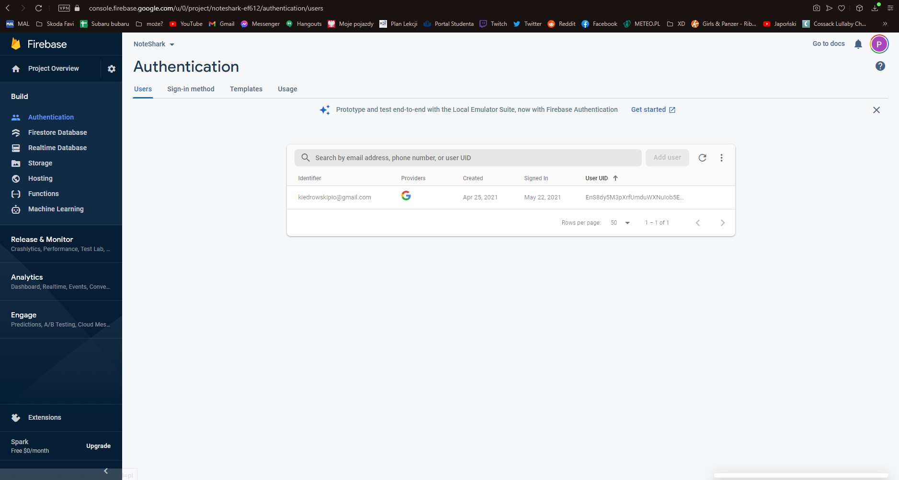
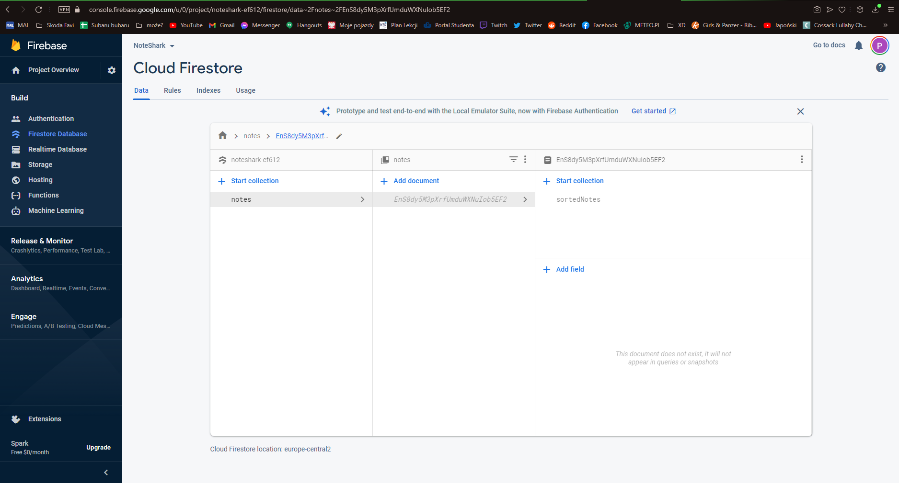
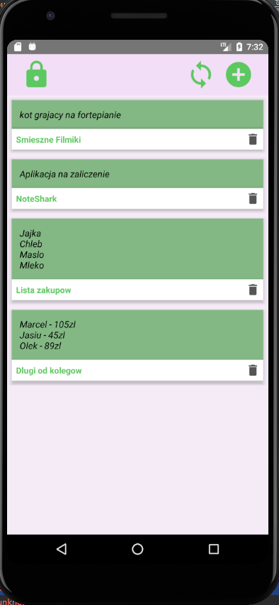
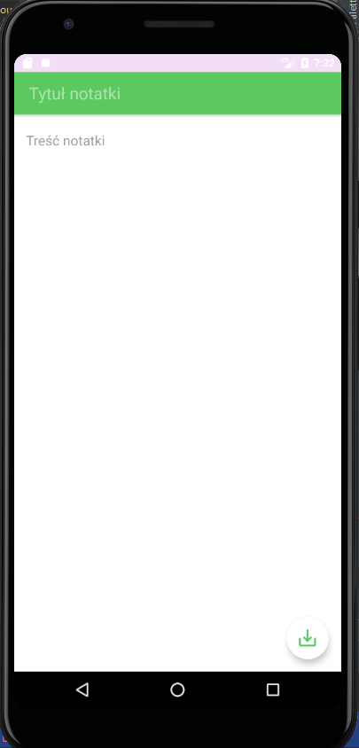
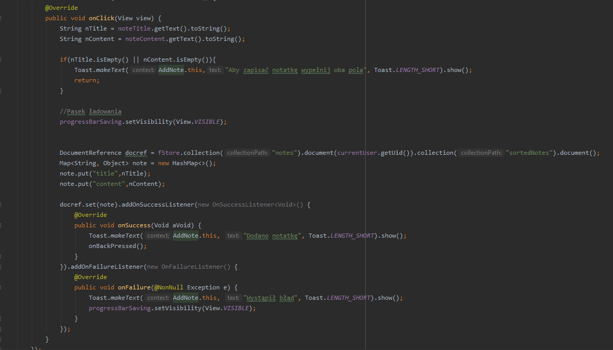
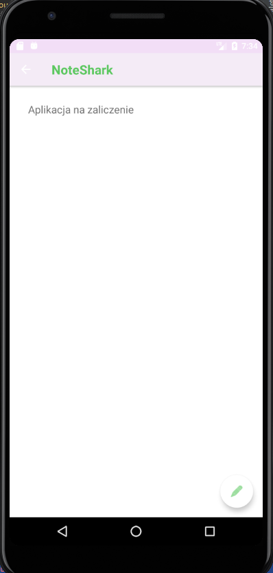

# NoteShark

Notatnik stworzony pod system operacyjny Android, wykorzystujący autoryzację oraz bazę danych Firebase.

## Aplikacja działa dzięki usłudze Firestore 

Notatki uporządkowane w kolekcje "sortedNotes" na bazie UID użytkownika.
Użytkownicy logują się do aplikacji za pomocą swojego konta Google.

## Funkcjonalności
### Aplikacja posiada funkcjonalości:
Wyświetlanie notatek dodanych przez danego użytkownika

Dodawanie notatek

Wyświetlanie notatek

Po zalogowaniu wyświetlany jest Toast z zalogowanym emailem

## Autorzy
Piotr Kiedrowski, Maciej Winnik
